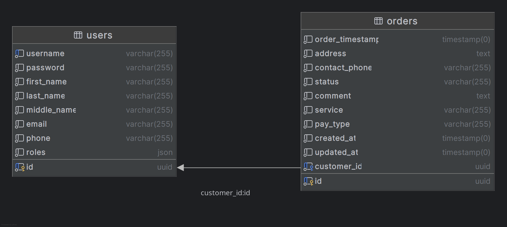

# App

## Установка и запуск

Для запуска проекта можно использовать **Docker Compose**. Инструкции для установки Docker Compose на вашей системе
можно посмотреть [Тут](https://docs.docker.com/compose/install/).

### Установка

При первом запуске необходимо выполнить следующие команды в терминале:

1. Перейти в папку `docker`

    ```bash
    cd docker
    ```

2. Скопировать файл `.env.dist` в `.env`:

    ```bash
    cp .env.dist .env
    ```

3. При необходимости в файле `.env` поправить значения переменных окружения.

   **Обязательно обратите внимание** на переменные `UID` и `GID` - это id пользователя и группы, под которыми будет
   запущено приложение. Они обязательно должны совпадать с id из основной хост системы. Для того, чтобы их узнать,
   воспользуйтесь командами `id -u` и `id -g` для id пользователя и пропишите их в файле `.env`.

4. Скачать и собрать все docker образы. Это может занять какое-то время:

    ```bash
    docker compose pull;
    docker compose build;
    ```

5. Запустите приложение командой:

    ```bash
    docker compose up -d
    ```

6. Войдите в контейнер приложения `app`:

    ```bash
    docker compose exec app bash
    ```

7. Выполните следующие команды внутри контейнера `app`:

    ```bash
    composer install;
    bin/console doctrine:migrations:migrate -n;
    ```
   
    Первая команда устанавливает зависимости приложения.
    Вторая запускает миграции схемы БД.

После этого установка будет завершена. А приложение можно открыть по тому порту, который был указан в переменной
окружения `APP_PORT` (По-умолчанию приложение доступно по адресу: http://localhost:8000)

### Запуск

Все команды необходимо выполняются в папке `docker`.

Запуск:

```bash
docker compose up -d
```

Выключение приложения:

```bash
docker compose down
```

Проверить состояние запущенного приложения:

```bash
docker compose ps
```

## ER-диаграмм


